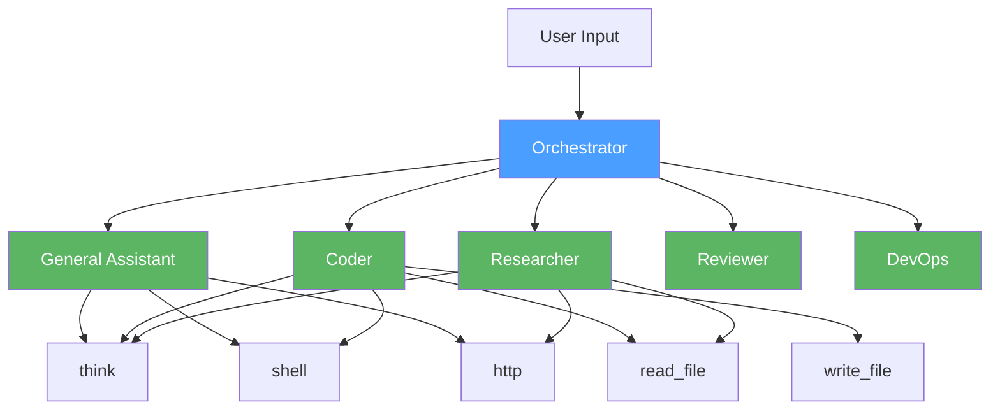

# Agent Catalog

Reference implementations of common agent types in Cognos. Each agent is defined behavior-first — what it should do, how it should behave — followed by the `.cog` implementation.

## Agent Types

| Agent | Description | Status |
|-------|-------------|--------|
| [General Assistant](general-assistant.md) | Conversational agent with tools, memory, and multi-turn context | ✅ Defined |
| Coder | Reads, writes, and refactors code with shell access | Planned |
| Researcher | Multi-source research with parallel search and synthesis | Planned |
| Reviewer | Structured review with typed output and severity ratings | Planned |
| DevOps | System health, deployment, incident response | Planned |
| Orchestrator | Coordinates multiple agents, delegates tasks | Planned |

## Design Pattern

Every agent follows the same structure:

1. **Persona** — who is this agent? What's its expertise?
2. **Capabilities** — what tools does it have access to?
3. **Behavior** — how does it handle different situations?
4. **Output contract** — what types does it produce?
5. **Error handling** — what happens when things go wrong?
6. **Implementation** — the `.cog` file

## Architecture

Agents can work standalone or be composed by an orchestrator. Each agent is a `.cog` file that can be imported and invoked by name.
