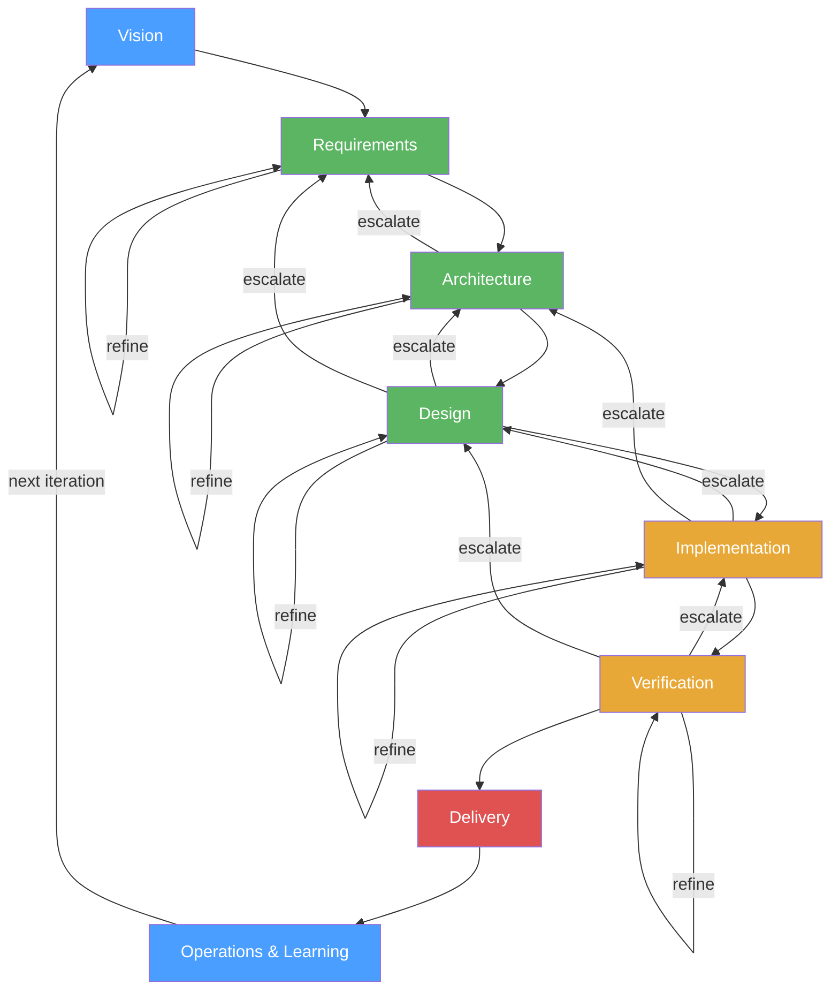
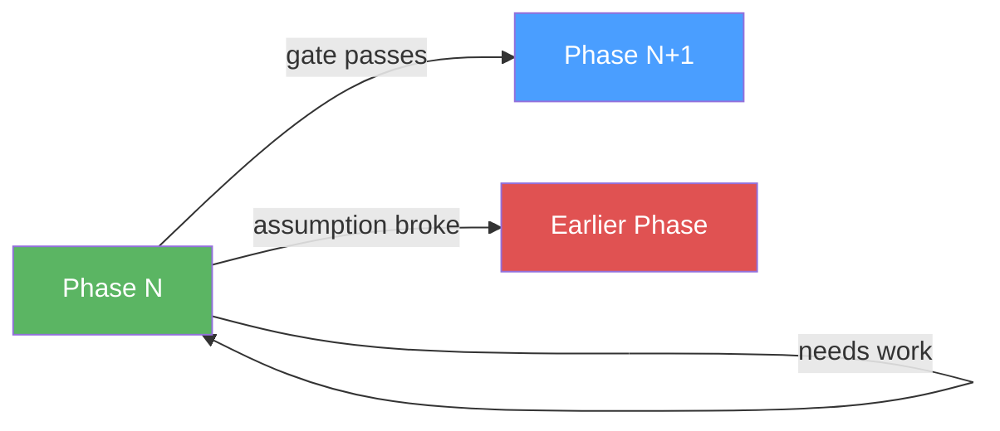
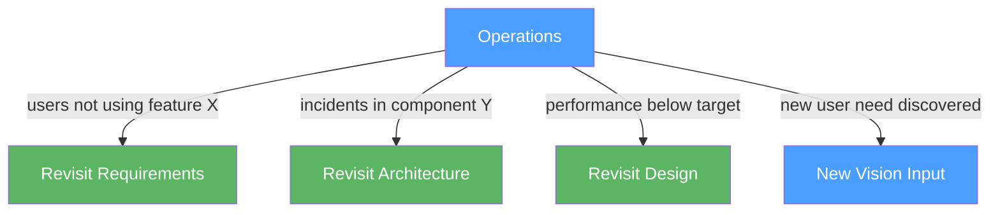
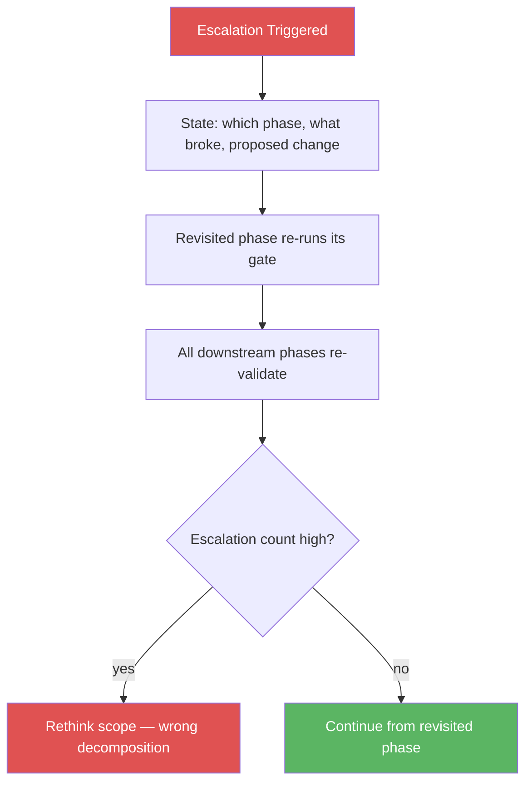

# Software Development Lifecycle — Spiral Process Model

A structured process from vision to delivery with explicit feedback loops, escalation rules, and incremental delivery.

---

## The Spiral

Every iteration delivers a vertical slice — thin but complete. Each phase can refine within itself or escalate to an earlier phase.



## Phase Outcomes

Every phase has exactly three possible outcomes:



1. **Pass gate** → proceed to next phase
2. **Refine** → loop within current phase until gate passes
3. **Escalate** → return to a specific earlier phase with explicit reason

---

## Iteration Strategy

```mermaid
graph LR
    subgraph Iteration 1
        direction LR
        V1[Smallest useful thing] --> D1[Prove architecture end-to-end]
    end
    subgraph Iteration 2
        direction LR
        V2[Add capability] --> D2[Deepen quality]
    end
    subgraph Iteration 3
        direction LR
        V3[Broaden scope] --> D3[Harden for production]
    end
    
    Iteration 1 --> Iteration 2 --> Iteration 3
```

Each iteration is a full spiral — vision through delivery. Never batch phases across iterations (that's waterfall in disguise).

---

## Phase 1: Vision → Requirements

**Input:** A vision statement — what we want to exist and why.

**Process:**
1. Break the vision into user-facing capabilities (what, not how)
2. For each capability, define acceptance criteria — how do we know it's done?
3. Identify constraints: performance, security, compliance, budget, timeline
4. Prioritize: what's essential for this iteration vs what can wait?
5. Identify risks and unknowns — what could kill this?

**Output:** Prioritized capabilities, acceptance criteria, constraints, known risks.

**Gate:** Requirements are clear, testable, and scoped to one iteration.

**Failure mode:** Vague requirements. No prioritization. Scope too large for one iteration. Gold-plating.

---

## Phase 2: Requirements → Architecture

**Input:** Approved requirements for this iteration.

**Process:**
1. Identify system boundaries — what's in scope, what's external?
2. Decompose into components with clear responsibilities
3. Define interfaces between components — contracts, not implementations
4. Choose technology based on constraints, not trends
5. Design for failure: what happens when each component fails?
6. Design for change: what's most likely to change? Isolate it.
7. Write ADRs for every non-obvious choice

**Output:** Component diagram, interface contracts, ADRs.

**Gate:** Architecture satisfies all requirements. Failure modes handled. As simple as possible.

**Escalate to Requirements when:** A requirement is technically infeasible or cost-prohibitive.

**Failure mode:** Over-engineering. Distributed when monolith suffices. No ADRs.

---

## Phase 3: Architecture → Design

**Input:** Approved architecture.

**Process:**
1. For each component: modules, data models, algorithms
2. Design the data model — hardest part, get it right
3. Define error handling strategy
4. Define testing strategy per component
5. Design API surfaces: minimal, consistent, hard to misuse
6. Write technical specifications

**Output:** Technical specifications, data models, API contracts, testing strategy.

**Gate:** Data model is right. APIs are minimal. Testing strategy is realistic.

**Escalate to Architecture when:** Component boundaries are wrong — discovered during detailed design.
**Escalate to Requirements when:** Acceptance criteria are ambiguous or contradictory.

**Failure mode:** Leaky abstractions. Data model compromises. No testing strategy.

---

## Phase 4: Design → Implementation

**Input:** Approved technical specifications.

**Process:**
1. Break into work units — each 1-3 days, with clear done criteria
2. Implement bottom-up: shared utilities → core logic → integration
3. Write tests alongside code, not after
4. Every work unit: code + tests + docs
5. Commits atomic: one logical change, always green
6. Code review on every change
7. Merge to main daily
8. Refactor as you go

**Output:** Working, tested, documented code on main branch.

**Gate:** All tests pass. Code review approved. Documentation updated.

**Escalate to Design when:** Spec has a gap or contradiction discovered during implementation.
**Escalate to Architecture when:** Performance or integration issues reveal wrong component boundaries.

**Failure mode:** Big-bang integration. Tests written after. Deferred refactoring.

---

## Phase 5: Implementation → Verification

**Input:** Code that passes unit and integration tests.

**Process:**
1. Full test suite: unit, integration, end-to-end
2. Verify against acceptance criteria from Phase 1 — every criterion, explicitly
3. Performance testing against defined constraints
4. Security review
5. Chaos testing: kill components, inject failures
6. User acceptance testing: real users, real scenarios

**Output:** Verification report. All criteria met or explicitly deferred with justification.

**Gate:** Ship/no-ship decision. No critical issues open. Runbook exists.

**Escalate to Implementation when:** Bug found — fix and re-verify.
**Escalate to Design when:** Systemic quality issue reveals design flaw.

**Failure mode:** Only testing happy paths. Skipping security. No chaos testing.

---

## Phase 6: Verification → Delivery

**Input:** Verified, ship-ready build.

**Process:**
1. Reproducible build artifacts, versioned, signed
2. Write/update runbook
3. Deploy to staging, smoke test
4. Deploy to production: canary → gradual → full
5. Monitor: error rates, latency, resources vs baseline
6. Bake period: no new deploys, watch for regressions

**Output:** Running production system, monitoring, runbook, verified rollback plan.

**Gate:** Bake period clean. Monitoring nominal.

**Escalate to Verification when:** Staging reveals issue not caught in verification.
**Escalate to Implementation when:** Production issue requires code fix → rollback first.

**Failure mode:** No canary. No rollback plan. No bake period.

---

## Phase 7: Operations & Learning

**Input:** Running production system.

**Process:**
1. Monitor continuously: SLOs, error budgets, user feedback
2. Incident response: detect → triage → mitigate → root cause → prevent
3. Blameless post-mortems with actionable follow-ups
4. Track tech debt: log it, schedule the fix
5. Measure outcomes, not output
6. Retrospective: what worked, what didn't, what changes?

**Output:** Operational metrics, incident reports, tech debt register, learnings for next iteration.

**Feeds back to Phase 1:** Learnings become input for the next iteration's vision.



---

## Escalation Rules



1. **Explicit:** Must state which phase to revisit, what assumption broke, and proposed change
2. **Cascading:** The revisited phase re-runs its gate; all downstream phases re-validate
3. **Tracked:** Count escalations — too many means wrong decomposition, rethink scope
4. **Never silent:** Deviating without escalating is the most dangerous failure mode

---

## Cross-Cutting Principles

1. **Every phase has a gate.** Don't proceed without passing. Gates prevent compounding errors.
2. **Feedback is explicit.** Refinement loops and escalations are tracked, not hidden.
3. **Fail fast, fail small.** Short iterations, quick feedback. A wrong decision found early costs 10x less.
4. **Automate repetition.** Testing, deployment, monitoring — human judgment for design.
5. **Single source of truth.** One place for requirements, architecture, runbooks. Never two copies.
6. **Optimize for change.** Requirements will change. Design for expected change, not all possible change.
7. **Quality is built in.** Every phase, not bolted on at the end.
8. **Vertical slices.** Each iteration is thin but complete — vision through delivery.
